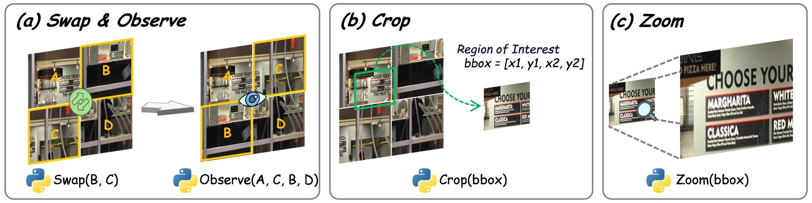
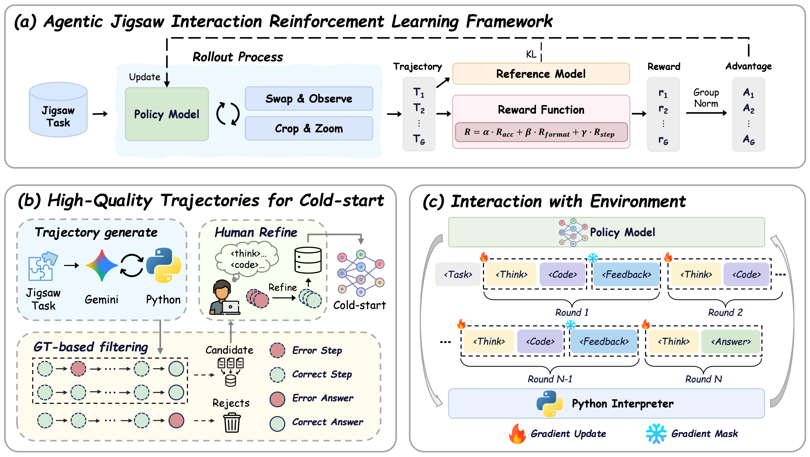
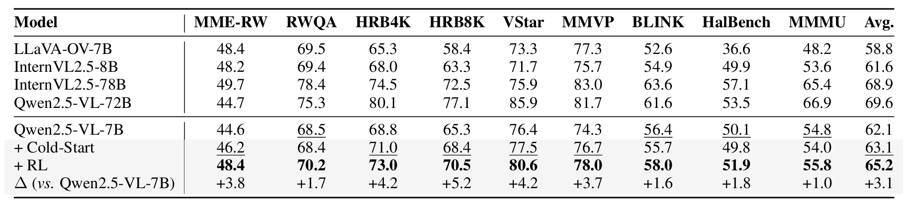
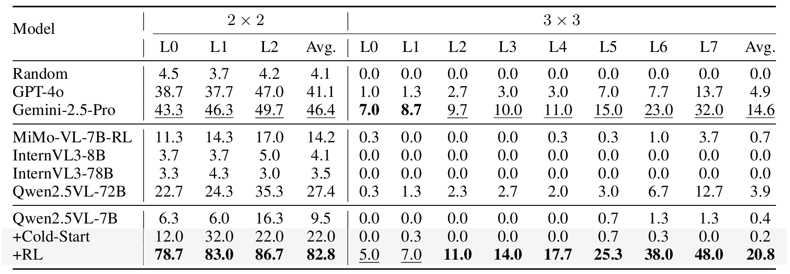
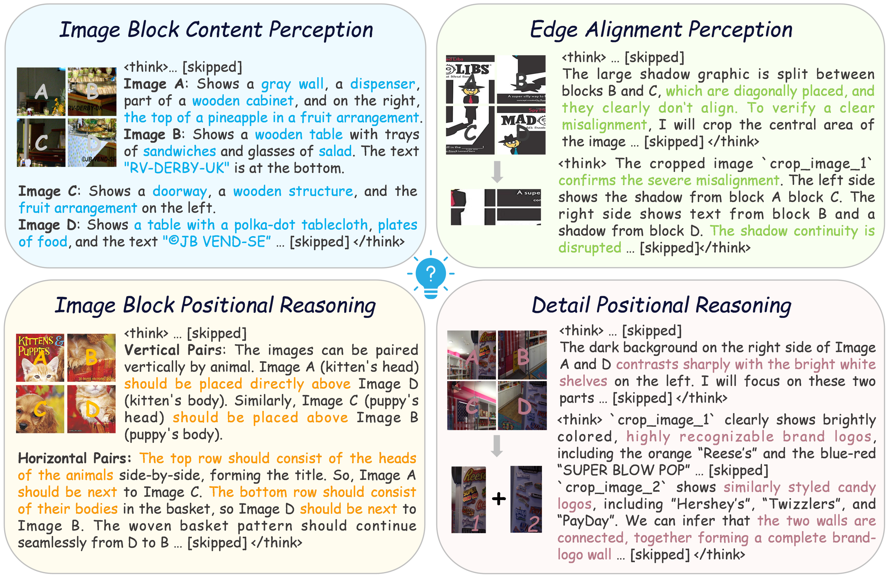

<h3 align="center"><a href="" style="color:#9C276A">
Agentic Jigsaw Interaction Learning for Enhancing Visual Perception and Reasoning in Vision-Language Models</a></h3>
<h5 align="center"> 


<h5 align="center">

[](https://huggingface.co/datasets/YuZeng260/AGILE)


## 🔍 Introduction

Official Implement of "Agentic Jigsaw Interaction Learning for Enhancing Visual Perception and Reasoning in Vision-Language Models"

> Although current large Vision-Language Models (VLMs) have advanced in multimodal understanding and reasoning, their fundamental perceptual and reasoning abilities remain limited. Specifically, even on simple jigsaw tasks, existing VLMs perform near randomly, revealing deficiencies in core perception and reasoning capabilities. While high-quality vision-language data can enhance these capabilities, its scarcity and limited scalability impose significant constraints. To address this, we propose **AGILE**, an **A**gentic ji**G**saw **I**nteraction **L**earning for **E**nhancing visual perception and reasoning in VLMs. AGILE formulates jigsaw solving as an interactive process, enabling the model to progressively engage with the environment. At each step, the model generates executable code to perform an action based on the current state, while the environment provides fine-grained visual feedback to guide task completion. Through this iterative cycle of observation and interaction, the model incrementally improves its perceptual and reasoning capabilities via exploration and feedback. Experimental results show that AGILE not only substantially boosts performance on jigsaw tasks of varying complexity (e.g., increasing accuracy from 9.5% to 82.8% under the 2 $\times$ 2 setting) but also demonstrates strong generalization across 9 general vision tasks, achieving an average improvement of 3.1%. These results indicate notable enhancements in both perceptual and reasoning abilities. This work opens a new avenue for advancing reasoning and generalization in multimodal models and provides an efficient, scalable solution to the scarcity of multimodal reinforcement learning data.

<div>
<center>
<p align="center">
<b>Description of the action space</b>
</p>

</div>

<div>
<center>
<p align="center">
<b>Overview of the AGILE framework</b>
</p>

</div>

## 🚀 News

**[2025/9/30]** Release [AGILE-Dataset](https://huggingface.co/datasets/YuZeng260/AGILE).🤗🤗🤗

## 🔧 Install Dependencies

```
# Clone the AGILE repository
git clone https://github.com/yuzeng0-0/AGILE.git
cd AGILE

# Create a new Conda environment with Python 3.10
conda create -n agile python=3.10

# Activate the new environment
conda activate agile

# Install the package
pip install pillow==11.2.1
pip install transformers==4.51.1
pip install vllm==0.8.2
pip install flash-attn==2.7.4.post1 --no-build-isolation
```

## 🛫 Get Start

### Train Data

You can download the dataset through huggingface via this [AGILE-Dataset](https://huggingface.co/datasets/YuZeng260/AGILE). Please place the train data files in the project directory with the following structure:

```
AGILE_Data/
├── cold_start/
│   ├── jigsaw/
│   ├── jigsaw2/
│   └── cold_start_1672.json
├── RL/
│   ├── BLINK_1523.parquet
│   ├── COCO_1657.parquet
│   └── ...
│   
```

 We conduct supervised fine-tuning (SFT) on llama-factory and reinforcement learning (RL) training on verl (**we adapted the verl codebase to enable multi-turn agent–jigsaw interactions.**), both with full-parameter tuning. For inference and evaluation, we adopt VLMEvalKit as the framework. All experiments are performed on 8 NVIDIA A100 GPUs with 80GB memory each.

## 📊 Experiment

On average, **AGILE surpasses the base model Qwen2.5-VL-7B by 3.1% across all 9 benchmarks**, providing compelling evidence that jigsaw-based training effectively enhances the model’s ability to capture visual relations and strengthen reasoning skills, thereby improving its performance on general vision downstream tasks.

<div>
<center>
<p align="center">
<b>Generalization to Downstream Visual Tasks</b>
</p>

</div>


After supervised fine-tuning and reinforcement learning, Qwen2.5-VL-7B achieves substantial improvements on the jigsaw task, significantly **surpassing Gemini2.5-Pro and Qwen2.5-VL-72B**. These results demonstrate that modeling jigsaw solving as an interactive multi-turn dialogue effectively enhances visual perception and reasoning.

<div>
<center>
<p align="center">
<b>Jigsaw Acc</b>
</p>

</div>


We showcase several jigsaw-solving behaviors, including interpreting individual pieces, validating edge alignment through cropping and zooming, and reasoning about semantic consistency. **These human-like strategies highlight the emergence of advanced perceptual and reasoning capabilities.**

<div>
<center>
<p align="center">
<b>Jigsaw-solving reasoning and behaviors exhibited by our model</b>
</p>

</div>

## 🖊️ Citation

If you find **AGILE** useful for your research and applications, please cite using this BibTeX:

```
TODO
```